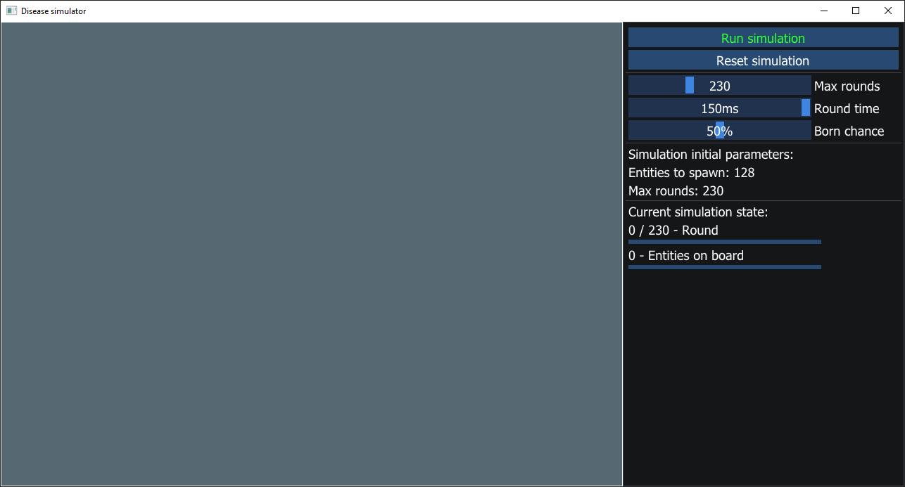

# Disease Spread Simulator

## Overview
The Disease Spread Simulator is a simple C++ program that simulates the spread of a virus/disease in a population based on provided data about individual units - their age, health status, movement speed, etc.

## Technologies and Tools
- **Programming Language:** C++20
- **Development Environment:** Visual Studio
- **Graphics Library:** DirectX12
- **User Interface:** ImGUI

## Simulation Rules

### Initialization:
Each individual has defined attributes: position on the grid, movement speed, direction, health state (sick, infected, recovering, healthy), age (<0; 100>), and immunity (low (0;3>, medium (3; 6>, high (6; 10>).
Each individual at the beginning of the simulation receives random position, direction, speed, state, and age (immunity depends on the randomly generated age of the individual).

### Movement:
During movement, an individual can change its direction if it hits a wall or another individual.

### Aging:
The age of an individual increases each turn, and immunity is adjusted accordingly.

### Births:
During encounters (collisions) between two individuals, births can occur (if their age is appropriate), one (when the chance of birth is sufficient) or two (1% chance) children. The born individual is always healthy and has maximum immunity.

### Death:
Occurs when an individual reaches the maximum age or when their immunity drops to zero.

### Progression of the Disease:
- **Infected** becomes **Sick** after 2 turns.
- **Sick** becomes **Recovering** after 7 turns.
- **Recovering** becomes **Healthy** after 5 turns.

### Impact on Immunity:
- **Infected**: -0.1/turn
- **Sick**: -0.5/turn
- **Recovering**: +0.1/turn
- **Healthy**: +0.05/turn

### Interactions between Individuals:
- **Healthy** + **Infected**:
  - **Healthy** -> **Infected** (when low immunity)
  - **Infected** remains unchanged.
- **Healthy** + **Sick**:
  - **Healthy** -> **Infected** (when low/medium immunity, -3 immunity for high)
  - **Sick** remains unchanged.
- **Healthy** + **Recovering**:
  - **Recovering** -> +1 immunity
  - **Healthy** remains unchanged.
- **Healthy** + **Healthy**:
  - Equalize immunity to the higher or maximum for the age group.
- **Sick** + **Infected**:
  - **Infected** -> **Sick** (when low/medium immunity)
  - **Sick** - Reset duration of health state
- **Sick** + **Recovering**:
  - **Recovering** -> **Infected** (when low/medium immunity)
  - **Sick** remains unchanged.
- **Sick** + **Sick**:
  - Equalize immunity to lower, reset duration of health state.
- **Infected** + **Recovering**:
  - **Recovering** -> -1 immunity
  - **Infected** remains unchanged.
- **Infected** + **Infected**:
  - Both -> -1 immunity.
- **Recovering** + **Recovering**:
  - No change.

## Screenshots

